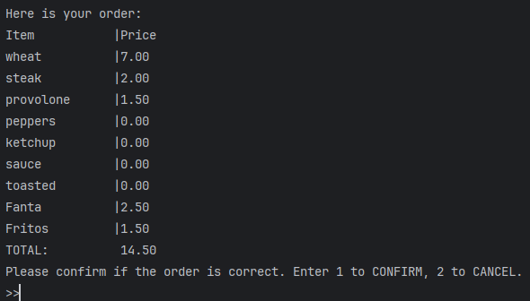

# Sandwitchcraft

Command line interface to make a customizable sandwich restaurant order.

## Features:
- Order sandwich with customizable toppings
- Order drinks and chips
- Displays receipt for confirmation
  - Saves to Receipts folder when confirmed

## Screenshots




## Code Highlight: Menu and Price Reader
This code views the MenuPrices.csv to create the database of menu items and their prices.
It can look up the specific price of the item based on the chosen sandwich size.
This should allow for easy future adjustment of menu items and prices through the csv file.

```
public class MenuReader {

    private List<Ingredient> ingredientList= new ArrayList<>();

    public MenuReader() {
        try {
            FileReader fr = new FileReader("Resources/MenuPrices.csv");
            BufferedReader br = new BufferedReader(fr);

            String dataLine;
            String[] dataFields;

            while ((dataLine = br.readLine()) != null){
                dataFields = dataLine.split("\\|");
                ingredientList.add(new Ingredient(dataFields[0], new String[]{dataFields[1],dataFields[2],dataFields[3]}));
            }

        } catch (FileNotFoundException e) {
            System.out.println("Unable to read file");
            throw new RuntimeException(e);
        } catch (IOException e) {
            System.out.println("File format incompatible.");
            throw new RuntimeException(e);
        }
    }

    public Orderable searchMenu(String _name){

        try {
            List<Ingredient> match = ingredientList.stream()
                    .filter( ing -> ing.getName().contains(_name))
                    .toList();

            return match.getFirst();
        } catch (Exception e) {
            System.out.println("Invalid selection, try again");
            return null;
        }
    }
```